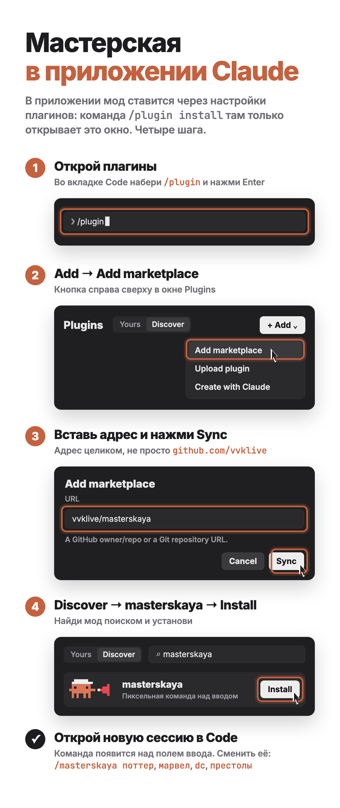

# Мастерская

Мод для Claude Code: над полем ввода живёт команда пиксельных Clawd. Главный Claude — менеджер: под каждый инструмент он зовёт исполнителя, агенты встают в тот же ряд, а когда работа кончилась, команда отдыхает.

*A Claude Code mod: a team of pixel Clawds lives above the prompt. Claude is the manager, every tool call brings in a specialist, subagents join the row, and when the work is done the team takes a break.*

## Установка

### В терминале

В Claude Code наберите:

```
/plugin install masterskaya --marketplace vvklive/masterskaya
```

Дальше `y`, чтобы добавить маркетплейс, и Enter на области установки (user — для всех сессий). Мод заработает сразу, без перезапуска.

### В приложении Claude (вкладка Code)

В приложении команда `/plugin install` только открывает окно плагинов, поэтому мод ставится через него:

1. Во вкладке Code наберите `/plugin` и нажмите Enter.
2. Нажмите «+ Add» и выберите Add marketplace.
3. В поле URL вставьте `vvklive/masterskaya` (адрес целиком) и нажмите Sync.
4. Откройте Discover, найдите `masterskaya` и нажмите Install.
5. Откройте новую сессию во вкладке Code: команда появится над полем ввода.



После установки менеджер один раз поздоровается и попросит звёздочку на GitHub. Можно нажать «Не сейчас» или просто начать работать — больше он не спросит.

Удалить: `/plugin uninstall masterskaya`.

## Что умеет

- Менеджер думает вслух. Главный Claude всегда в каске с мегафоном, рядом хвост его мыслей в реальном времени.
- Каждому инструменту свой мастер. Bash — механик, Read и Grep — исследователь, Edit — редактор, Write — писатель, WebSearch — разведчик, Figma — дизайнер, генерация картинок — художник, Skill и ToolSearch — библиотекарь. Всего 11 профессий.
- Работает тот, кто пишет. Исполнитель встаёт к работе, как только модель начинает писать вызов: правку пишет редактор, команду набирает механик. Менеджер в это время смотрит за командой, а не машет мегафоном.
- Агенты встают в тот же ряд. Каждый сабагент — отдельный человечек со своей задачей и профессией, которая меняется под его инструменты.
- Видно, кто чем занят. Пока идёт работа, в полосе все, кто работает: не влезают с подписями — стоят одними спрайтами, дальше «+N». Работы нет — менеджер и до двух отдыхающих.
- Перерыв. 17 занятий: сон, кофе, курочка, душ, газета, телефон, гантели, музыка, танцы, шарик, приставка, гитара, медитация, цветок, жонглирование, картина, прогулка. И 2 игры вдвоём: болтают и перекидываются мячом.
- Пять команд на выбор. Стандартная (Clawd в касках и беретах), «Гарри Поттер», «Мстители», «Лига Справедливости» и «Игра престолов». Персонажи в костюмах, самые известные — на самых частых работах. Поттер: менеджер Дамблдор, Bash — Гарри, чтение — Гермиона, сеть — Волдеморт. Мстители: Железный человек, Человек-паук, Халк, Тор. Лига: Бэтмен, Супермен, Чудо-женщина, Флэш, дальше Джокер, Харли Квинн, Робин, Зелёный Фонарь, Киборг, Аквамен и Альфред. Престолы: Дейенерис, Джон Сноу, Тирион, Арья, дальше Серсея, Санса, Ходор, Мелисандра, Бран, Нед Старк и Варис. Сменить: `/masterskaya поттер`, `марвел`, `dc`, `престолы`, `стандарт` (или 1–5), либо кнопками в панели `/masterskaya`. Выбор запоминается.
- Приходят и уходят по-своему. Стандартные выбегают из-за края, тормозят в облачке пыли и убегают с разгона; волшебники трансгрессируют с хлопком и дымом; Мстители подлетают на репульсорах и улетают вверх; Лига проносится молнией, как Флэш; в «Престолах» идут сквозь метель. Ушёл сосед — остальные подходят парой шагов, а не перепрыгивают.
- Полоса подстраивается под ширину. Главному — узкая колонка, подписи команды ужимаются, потом остаются одни фигурки, потом «+N». Пока идёт задача, рядом все, кого в ней звали.
- Сабагенты — тоже из вселенной. У Поттера это Сириус, Джинни, Невилл, Беллатриса, Фред и Джордж; у Мстителей — Дэдпул, Звёздный Лорд, Ракета, Соколиный глаз, Вижн и Капитан Марвел; у Лиги — Шазам, Зелёная Стрела, Супергёрл, Лекс Лютор, Марсианин и Загадочник; в «Престолах» — Джейме, Бриенна, Пёс, Ночной король, Джоффри и Мизинец. Каждый новый сабагент получает свободного персонажа, думает облачками, а сдав работу, уходит домой. В стандартной команде сабагент, как и раньше, меняет профессию под инструмент.
- Свои слова и досуг у каждой команды. У Поттера Bash «колдует», поиск — «Акцио», Добби «ждёт приказа хозяина», а на отдыхе шоколадные лягушки, сливочное пиво, «Пророк», шахматы, метла и дуэли. У Мстителей Человек-паук «выстреливает», Халк «ХАЛК ЧИТАЕТ», Грут правит словами «Я есть Грут», а на отдыхе шаурма, «Дейли Бьюгл», репульсоры, Камни бесконечности и броски щитом.
- Не мешает работе. Полоса — 5 строк над полем ввода, сворачивается (`ctrl+x ctrl+a` или `[-]`). Большая панель со всеми — `/masterskaya`.

## Где работает

| Где | Что видно |
| --- | --- |
| Claude Code в терминале (и в терминале VS Code) | полоса над вводом с пиксельной анимацией |
| Приложение Claude, вкладка Code | та же полоса, спрайты картинками |
| Панель расширения VS Code | команда в панели `/masterskaya` |
| Чаты claude.ai, телефон | нет: моды живут только в Claude Code |

Проверено на Claude Code 2.1.291.

Лист кадров команды: `node dev/sheet.mjs out.png potter`, досуг — `… potter rest`, приход и уход — `… standard move`.

## Разработка

```
claude plugin validate .
claude plugin test .
claude --plugin-dir .
```

Код: `hooks/register.tsx` (события и полоса), `hooks/sprites.ts` (пиксель-арт), `hooks/roles.ts` (профессии и команды), `hooks/life.ts` (досуг).

MIT
